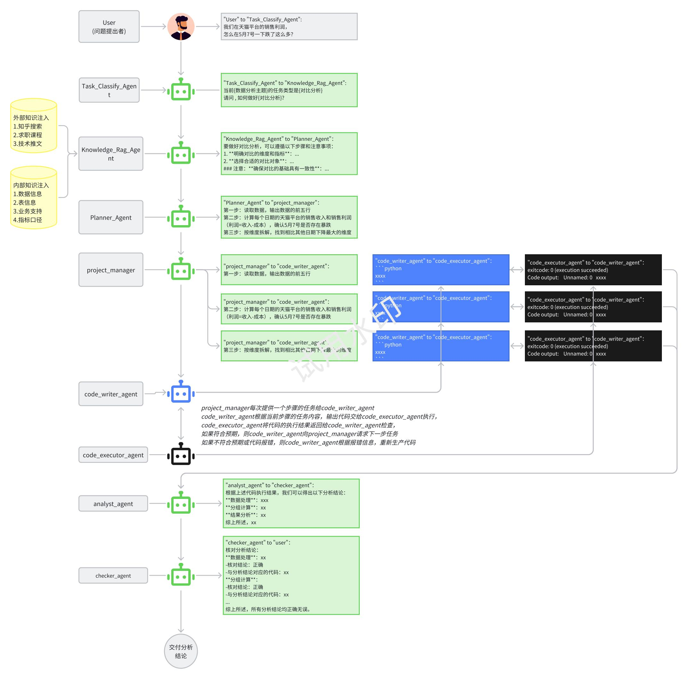

# (〃’▽’〃) Let Agent be DataAnalyst
<h1 align="left">

</h1>


**Name**：Data Analysis Intelligent Assistant

**Description**：
This is an intelligent Agent project for data analysis, aiming to help users process and understand data more efficiently and accurately.




 
 


 
**Installation and Running**：
1. Environmental Requirements
    - Python Version: 3.8 and above
    - Dependent Libraries: pandas, numpy, matplotlib, etc. They can be installed by the following command:
        ```
        pip install -r requirements.txt
        ```
2. Clone the Project
        ```
        git clone https://github.com/your_username/your_project.git
        ```
3. Running
    - Enter the project directory
    - Execute python main.py

**Project Structure**：
```
your_project/
├── data/
│   ├── sample_data.csv
│   └──...
├── src/
│   ├── agent.py
│   ├── utils.py
│   └──...
├── requirements.txt
├── README.md
└── main.py
```

**demo**：
```python
from agent import DataAnalysisAgent

agent = DataAnalysisAgent()
data = agent.load_data('data/sample_data.csv')
summary = agent.summarize_data(data)
print(summary)
```

**Contribution Guide**:
If you wish to contribute to this project, please follow the following steps:
1. Fork this repository
2. Create a new branch for your modifications
3. Submit your changes and create a Pull Request
4. We will review and merge your contribution
   
**Copyright and License**
This project follows the MIT License Agreement

**Contact Information**:
If you have any questions or suggestions, please contact us via the following methods:
Email: [your_email@example.com]
