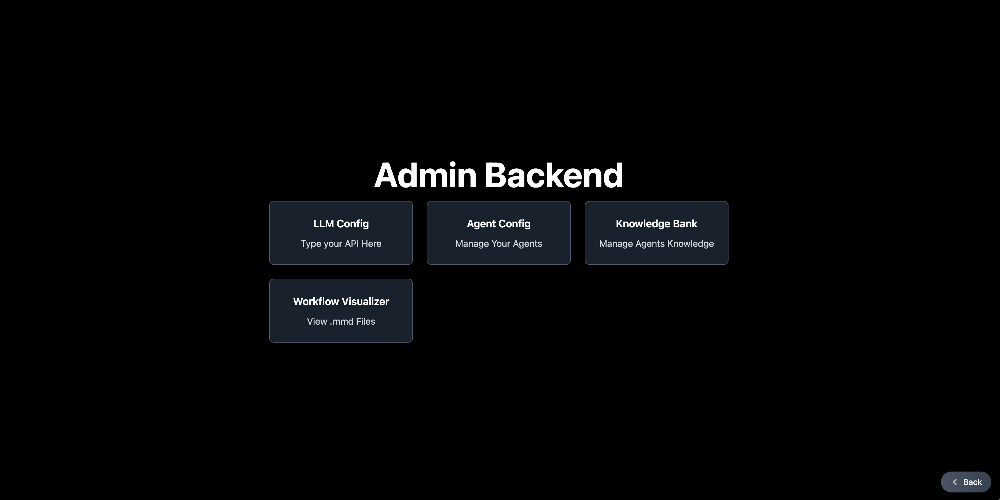
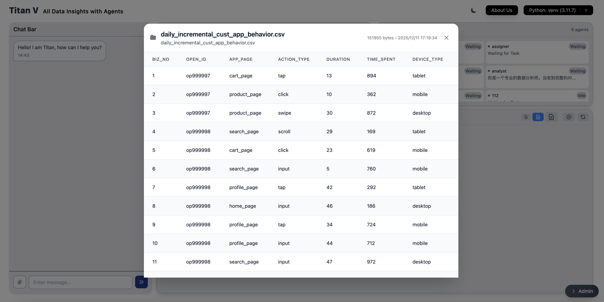
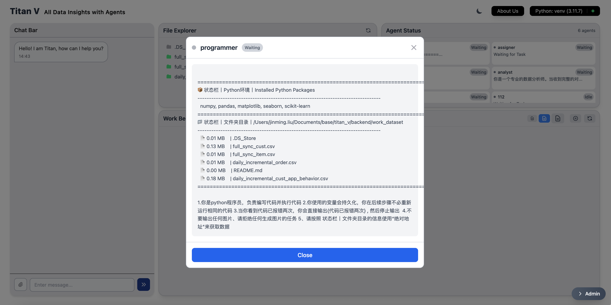
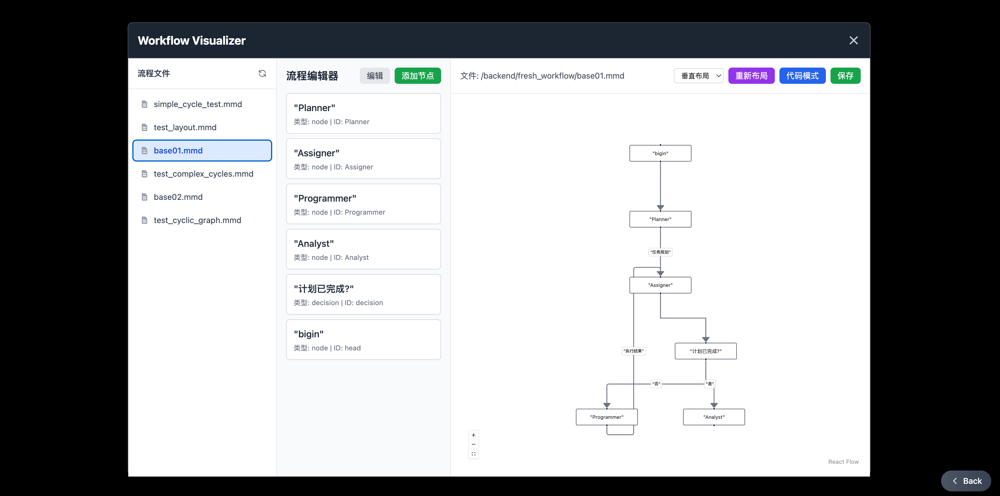

# Titan V
A modern multi-agent AI collaborative data analysis platform that integrates React frontend, Python FastAPI backend, and CAMEL AI framework to provide a complete AI-driven data analysis solution.


<table>
  <tr>
    <td></td>
    <td></td>
  </tr>
  <tr>
    <td></td>
    <td></td>
  </tr>
  <tr>
    <td></td>
    <td></td>
  </tr>
</table>


## 🔗 Version 2.0

## 🌟 Core Features
- **Multi-Agent Collaboration System**: Intelligent collaboration based on CAMEL framework
- **Smart Data Analysis**: Automatic CSV data processing, machine learning model training, predictive analytics
- **Real-time AI Conversation**: ChatGPT-style intelligent conversation interface
- **Code Generation & Execution**: Automatic Python code generation, execution, and result analysis
- **Real-time Synchronization**: Real-time updates of agent status, file system, and workbench output
- **File Management**: Complete file upload, browse, and preview functionality
- **Workflow Transparency**: Complete agent thinking process and execution logs display

## 🚀 Quick Start

### Environment Requirements
- **Node.js**: >= 16.0.0
- **Python**: >= 3.11
- **npm**: >= 8.0.0
- **pip**: Python package manager

### 1. Clone Project
```bash
git clone <repository-url>
cd titan-v
```

### 2. Create Virtual Environment (Recommended)
```bash
# Create virtual environment in root directory
python -m venv venv
source venv/bin/activate  # Linux/Mac
# or
venv\Scripts\activate  # Windows
```

### 3. Frontend Installation
```bash
npm install
```

### 4. Backend Installation
```bash
cd backend
# Install dependencies
pip install -r requirements.txt
```

### 5. Configure Environment Variables
```bash
cp backend/.env.example backend/.env
# Edit backend/.env and configure your API keys
```

### 6. Start Services

```bash
# Start frontend + backend
npm start

# Start backend only
cd backend && python main.py
```

#### Access Application
- **Frontend Interface**: http://localhost:3000
- **API Documentation**: http://localhost:8000/docs
- **Health Check**: http://localhost:8000

## 📁 Project Structure

```
titan-v/
├── 📁 backend/                    # Python FastAPI backend
│   ├── main.py                   # FastAPI main application
│   ├── titan.py                  # CAMEL Agent core logic
│   ├── requirements.txt          # Python dependencies
│   ├── .env.example             # Environment variables template
│   ├── start_backend.sh         # Backend startup script
│   ├── utils/                   # Utility modules
│   │   ├── agent_factory.py     # Agent factory
│   │   ├── agent_manager.py     # Agent manager
│   │   └── status_bar.py        # Status bar utility
│   ├── work_dataset/            # Dataset directory
│   └── work_document/           # Document output directory
├── 📁 src/                      # React frontend source
│   ├── components/              # React components
│   │   ├── ChatPanel.tsx        # Chat interface
│   │   ├── AgentStatusPanel.tsx # Agent status panel
│   │   ├── FileExplorer.tsx     # File explorer
│   │   ├── Workbench.tsx        # Workbench output
│   │   └── AdminDashboard.tsx   # Admin dashboard
│   ├── utils/                   # Frontend utilities
│   │   ├── api.ts              # API interface definitions
│   │   └── fileSystem.ts       # File system utilities
│   └── App.tsx                 # Main application component
├── 📁 public/                   # Static assets
├── server.js                   # Express file server (backup)
├── package.json                # Frontend dependency configuration
├── tailwind.config.js          # Tailwind CSS configuration
└── tsconfig.json               # TypeScript configuration
```

## 🛠 Technology Stack

### Frontend Technology Stack
- **React 18.2.0**: Modern React framework
- **TypeScript 4.9**: Complete type safety
- **Tailwind CSS 3.3**: Atomic CSS framework
- **React Markdown 10.1.0**: Markdown rendering
- **React Syntax Highlighter 15.6.1**: Code highlighting
- **Lucide React 0.536.0**: Modern icon library

### Backend Technology Stack
- **FastAPI 0.115.0**: Modern Python web framework
- **CAMEL AI 0.2.74**: Multi-agent AI framework
- **Uvicorn 0.24.0**: ASGI server

### Development Tools
- **React Scripts 5.0.1**: Create React App toolchain
- **PostCSS 8.4 + Autoprefixer 10.4**: CSS processing tools
- **ESLint**: Code quality inspection
- **Jupyter**: Code execution environment support

## 🔧 API Endpoints
- `GET /` - Service health check
- `GET /docs` - Swagger API documentation
- `POST /api/chat` - Send message to AI Agent
- `POST /api/upload` - File upload
- `GET /api/files` - Get file list
- `GET /api/file/{filename}` - Get file content
- `GET /api/agent-states` - Get agent status


### TODO
- File Explorer: Display specific folder path in the top right corner of the card using gray font (real relative path from current project folder, not static)
- Workflow Visualizer: Enable drag-and-drop modification of flowchart Mermaid files (e.g., base01.mmd) internal process relationships through the frontend interface
- Design new code additions in a separate folder without affecting other modules and existing code
- Use concise and effective implementation solutions, functional requirements only, no need for perfection


